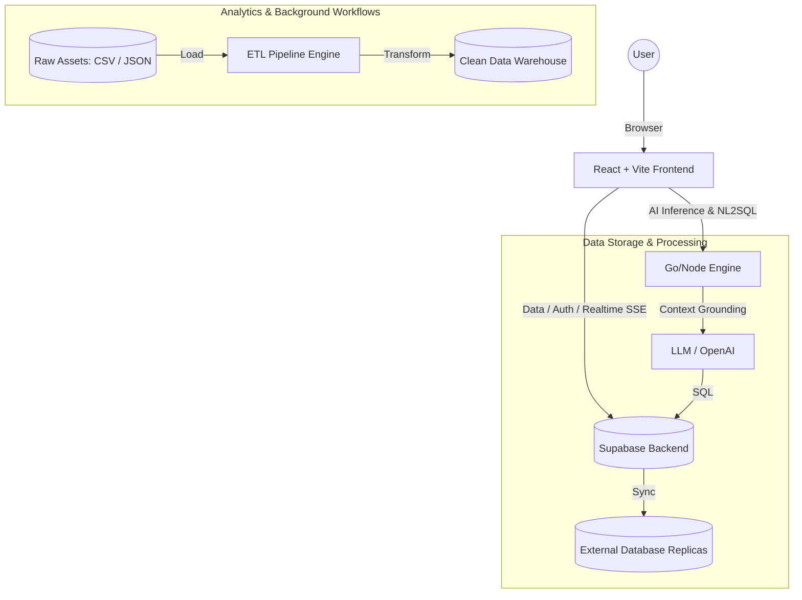

<div align="center">
  
  
  
  
  
  
  
  <h1>Neuradash : Enterprise AI Analytics & BI Platform</h1>
  <p>A comprehensive, high-performance Business Intelligence (BI) and Data Engineering platform empowering organizations to bridge the gap between raw data silos and strategic decision-making.</p>
</div>

---

**Neuradash** acts as an all-in-one Data Operating System. From bringing in raw data via Visual ETL, tracking metrics via KPI Scorecards, building responsive dashboards, all the way to querying data via our **Natural Language to SQL (NL2SQL) AI Engine**, Neuradash handles the full lifecycle of modern enterprise analytics.

## 🚀 Comprehensive Feature Setup

We've evolved far beyond a simple dashboarding tool. Neuradash  is equipped with over **40+ specialized modules** dedicated to deep data work.

### 🤖 AI-Powered Analytics

- **Ask Data (NL2SQL)**: Chat with your data. A highly optimized AI inference engine converts natural language to optimized SQL queries and automatically renders the appropriate charts.
- **Hybrid Prompt Refiner (✨)**: One-click "Polishing" of natural language inputs. Automatically transforms raw user queries into professional, unambiguous instructions tailored to SQL or Report contexts.
- **Automated Follow-up Suggestions**: Predictive "Suggestion Pills" that appear after every AI response, guiding users toward deeper analysis or alternate visualization styles.
- **AI Reports & Data Stories**: Automatically generates executive summaries and explanatory narratives from raw datasets or specific visualizations.
- **Enterprise Data Assistant**: Context-aware AI assistant integrated directly into the SQL Query Editor and ETL pipelines to aid in complex logic formulation and debugging.

### 🛠️ Data Engineering & Modeling

- **Visual ETL & Pipeline Builder**: A node-based, drag-and-drop interface for Extracting, Transforming, and Loading (ETL) your data.
- **Dynamic Resource-Aware Chunking (✨)**: The backend automatically monitors available system RAM in real-time and adjusts processing speeds/batch sizes dynamically. This ensures 100% uptime even on resource-constrained servers (like Render Free Tier) by preventing OOM crashes during massive data imports.
- **Checkpoint & Auto-Resume**: Progress is persisted after every batch. If the server restarts (OOM/Cold-start), interrupted pipelines automatically resume from the last successful checkpoint.
- **Smart Schema & DB Diagram (ERD)**: Automated database profiling to visualize table relationships, foreign keys, and constraints perfectly.
- **Data Modeling & calculated Fields**: Add custom business logic, derived metrics, and dynamic calculated columns.
- **Data Profiling**: Deep insights instantly into your datasets (null distributions, min/max metrics, categorical breakdowns).
- **Data Refresh**: Set up automated synchronization schedules for keeping datasets in parity with live sources.
- **External Connections**: Out-of-the-box support to plug into external PostgreSQL, MySQL, SQL Server, Snowflake, and BigQuery instances.
- **Data Upload**: Native parsing and uploads of massive CSV, JSON, and Excel documents.

### 📊 Advanced Visualization & Dashboarding

- **Chart & Dashboard Builder**: Responsive, grid-based drag-and-drop canvas supporting an expansive library of rich interactable elements.
- **Geo-Visualization**: Interactive spatial mapping for regional performance. Powered by MapLibre and Deck.gl for millions of data points.
- **Pivot Tables**: Advanced multi-dimensional tabular operations to slice and dice categorical data natively in the browser.
- **KPI Scorecards**: Executive metric tracking, benchmarking, and real-time comparative analysis against targets.
- **Interactive Drill-Downs & Cross-Filtering**: Effortlessly narrow down details. Clicking an element in one chart automatically filters every other chart on the dashboard.
- **Conditional Formatting**: Excel-like cell formatting logic to highlight anomalies visually.

### 🔐 Enterprise Governance & Security

- **Row-Level Security (RLS) & Data Privacy**: Highly granular access control policies to ensure multi-tenant safety and PII protection.
- **Embed & Share (Iframe)**: Secure, signed URLs and mechanisms to embed specific charts or full dashboards into external company portals.
- **Scheduled Reports**: Push automated dashboards as PDFs or images via Email or Webhooks.
- **Annotations & Alerts**: Set up threshold-based alerts (e.g., "Alert me if revenue drops below $5k") and annotate specific chart peaks for team collaboration.
- **Bookmarks & Report Templates**: Save specific states of filters/parameters, and reuse standardized report UI layouts instantly.

### 📂 Supported External Databases & Formats

| Category | Supported Items |
|----------|----------------|
| **Databases** | PostgreSQL (Supabase, Neon, AWS RDS), MySQL, SQL Server (Azure), SQLite, ClickHouse, DuckDB |
| **BI Formats** | Power BI (`.pbix`), Tableau (`.twb`, `.twbx`), PowerPoint (`.pptx`) |
| **Files** | CSV, Excel, JSON (Max 100 MB) |

---

## 🏛️ System Architecture

Neuradash utilizes a decoupled **Clean Architecture**, supporting stateless frontend interactions with highly specialized backend services.



---

## 💻 Technical Stack

This project is built using 2024-standard modern web primitives:

### **Frontend Infrastructure**

- **Core Framework**: React 18 + TypeScript + Vite.
- **Styling**: Tailwind CSS, Shadcn UI (accessible Radix primitives).
- **State & Data**: Zustand (Global UI state), TanStack Query / React Query (Server-state caching).
- **Visuals & Charts**: Apache ECharts, Recharts, Deck.gl, React Map GL for rendering robust top-tier graphical reports.
- **Interactions**: Framer Motion (micro-animations), @hello-pangea/dnd / React Grid Layout (Dashboard Canvas).

### **Backend & Infrastructure**

- **Language & Framework**: Go 1.22 + Fiber v2 (High-performance API engine).
- **ORM & Database**: GORM + PostgreSQL 16 (Stateless architecture with RLS).
- **Cache & Realtime**: Redis 7 (Speed) + WebSocket Hub (Live updates).
- **Storage**: MinIO / AWS S3 compatible (Asset & dataset storage).
- **Security**: JWT (Refresh token rotation) + Bcrypt (Hashing).
- **AI Core**: Native LLM bridging for context-grounded NL2SQL execution.

---

## 🛣️ API Overview (v1)

| Method | Path | Description |
|--------|------|-------------|
| POST | `/auth/login` | Secure JWT Authentication |
| POST | `/datasets/upload` | Multipart file upload (CSV/Excel) |
| POST | `/import/confirm` | Finalize ETL configuration |
| POST | `/connections/sync` | Live DB Introspection |
| POST | `/connections/query` | Secure Read-only SQL Execution |

---

## 📂 Project Structure

```text
.
├── src/
│   ├── components/        # Isolated, reusable UI components and generic templates
│   ├── context/           # React Context (AuthContext for session management)
│   ├── hooks/             # Utility hooks (window dimension tracking, debouncing)
│   ├── lib/               # Utilities (Tailwind `cn` merger, standard helper logic)
│   ├── pages/             # 40+ Top-Level Features (AskData, Dashboard, ChartBuilder, GeoVisualization, etc.)
│   ├── App.tsx            # Main router configuration linking all features
│   └── main.tsx           # Entry point
├── tailwind.config.ts     # Global styling variables and custom animations
├── package.json           # Dependencies and scripts
└── README.md              # You are here!
```

---

## ⚙️ Development Guide

### Prerequisites

- Node.js (v18+)
- npm or pnpm
- A Supabase Project configured locally or in the cloud for DB and Authentication handling.

### Quick Setup

1. **Clone the repository:**

   ```bash
   git clone https://github.com/yogisyahroni/TOOLS_BI.git
   cd TOOLS_BI
   ```

2. **Install Frontend Dependencies:**

   ```bash
   npm install
   ```

3. **Configure the Environment:**
   Create `.env` files in both root (frontend) and `neuradash-backend/` (backend).
   - **Backend Setup**: `cp neuradash-backend/.env.example neuradash-backend/.env`
   - **Key Variables**: `DATABASE_URL`, `REDIS_ADDR`, `MINIO_ENDPOINT`.

4. **Boot Infrastructure (Docker):**
   ```bash
   docker-compose up -d
   ```

5. **Run Backend (Go):**
   ```bash
   cd neuradash-backend/
   go run ./cmd/server/
   ```

6. **Run Frontend (React):**
   ```bash
   npm run dev
   ```

### 🧪 Quality Assurance

```bash
# Backend unit tests (isolated logic)
go test ./internal/engine/... ./internal/parser/... -v

# Full project coverage
go test ./... -v
```

7. **Build for Production / Deployment:**

   ```bash
   npm run build
   ```

---

## 📩 Contact & Purpose

*This project exemplifies capabilities in complex full-stack architectures, high-performance data engineering, scalable UI ecosystems, and native AI integration.*

- **Ultimate Goal**: Create a self-service reality empowering non-technical stakeholders to get 10x faster speed-to-insight without writing SQL.
- **Production Checklist**: 
  - [ ] Set `JWT_SECRET` (64-byte random string).
  - [ ] Set `SERVER_ENV=production`.
  - [ ] Configure PostgreSQL SSL (`sslmode=require`).
  - [ ] Build: `go build -ldflags="-s -w" -o server ./cmd/server/`.
- **Availability**: Open to Data Engineer, Backend/Frontend Architect, or Senior Full-stack opportunities.
