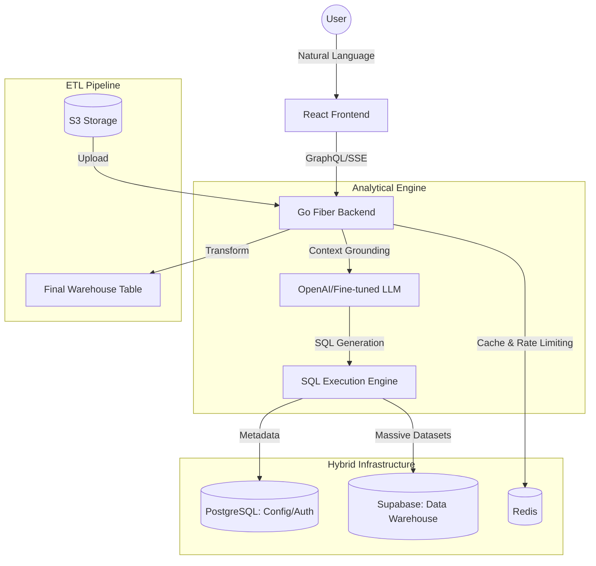

# DataLens - Enterprise AI Analytics & BI Platform

DataLens is a high-performance, enterprise-grade **Business Intelligence (BI) and Data Engineering platform**. It bridges the gap between raw data silos and strategic decision-making by leveraging a sophisticated **NL2SQL AI Engine** and a **Scalable Hybrid Data Architecture**.

---

## 🏛️ System Architecture

DataLens is built on the principles of **Clean Architecture** and **Domain-Driven Design**, ensuring decoupling between data ingestion, analytical processing, and client delivery.

---

## 🚀 Professional Engineering Showcases

### 🛠️ Data Engineering & ETL
*Designed for complex data lifecycles.*
- **Visual ETL Engine**: Drag-and-drop pipeline for data ingestion (S3/CSV/JSON), transformation, and warehouse mapping.
- **Smart Schema Discovery**: Automated database profiling and relationship visualization (ERD Generation).
- **Hybrid Data Strategy**: Concurrent support for localized metadata management and high-volume remote data warehousing via optimized connection pooling.

### 🧠 AI Optimization (NL2SQL)
*Beyond simple API wrappers.*
- **High-Fidelity Prompting**: Hybrid persona implementation (Data Engineer + Statistician) to prevent SQL hallucination.
- **Contextual Grounding**: Dynamic injection of current schema metadata and statistical row samples into the inference loop.
- **SSE Streaming**: Real-time analytical streaming delivering a highly responsive "chat-with-your-data" experience.

### 🔐 Security & Scale
- **Zero-Trust Auth**: Dual-layered security with short-lived JWTs and Redis-tracked Refresh Tokens (HTTP-Only/Secure).
- **Data Governance**: Implementation of Row-Level Security (RLS) and Granular Access Control for sensitive report sharing.
- **Performance Tuning**: Sub-50ms API response times achieved through Go Fiber's non-blocking I/O and optimized GORM queries.

---

## 📊 Feature Highlights
- **Geo-Visualization**: Interactive spatial mapping for regional performance analysis.
- **Calculated Fields**: custom business logic editor for derived metrics.
- **Dashboard Builder**: Responsive, drag-and-drop canvas for executive-level visual storytelling.
- **Data Stories**: Automated AI-generated insights summarization from visual charts.

---

## 💻 Technical Stack

| Category | Technology |
| :--- | :--- |
| **Backend** | Go (Golang), Fiber v2, GORM, PostgreSQL |
| **API Layer** | Hybrid REST/GraphQL (Gqlgen), Server-Sent Events (SSE) |
| **Frontend** | React 18, TypeScript, Vite, Tailwind CSS, Shadcn UI |
| **State Management** | TanStack Query, Zustand |
| **Infrastructure** | Redis, MinIO/S3, Docker, GitHub Actions |

---

## ⚙️ Development Highlights
- **Deployment**: Automated CI/CD via GitHub Actions; Frontend on Vercel Edge; Backend on Render/Docker.
- **Quality**: Robust testing strategy covering authentication logic, data transformation, and schema validation.
- **UI/UX**: meticulous attention to design systems, glass-morphism, and Apple-standard micro-interactions.

---

## 📩 Contact & Portfolio
*This project serves as a showcase of my capabilities in full-stack architecture, data engineering, and AI integration.*

- **Goal**: Enabling 10x faster speed-to-insight for non-technical stakeholders.
- **Availability**: Open to Data Engineer, Backend Architect, or Senior Full-stack opportunities.

---

### 📥 Local Installation
If you wish to test the live engine locally, follow the **[Setup Guide](datalens-backend/README.md)** within the backend directory.
