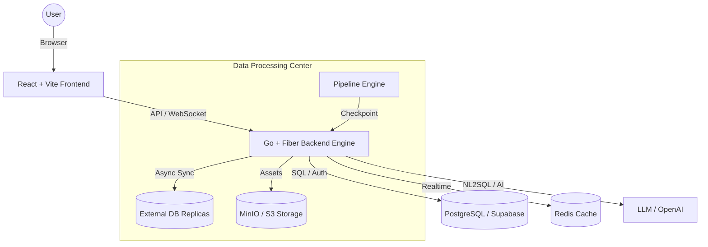

<div align="center">
  
  
  
  
  
  

  <h1>Neuradash : Enterprise AI Analytics & BI Platform</h1>
  <p>A comprehensive, high-performance Business Intelligence (BI) and Data Engineering platform empowering organizations to bridge the gap between raw data silos and strategic decision-making.</p>
</div>

---

**Neuradash** acts as an all-in-one Data Operating System. From bringing in raw data via Visual ETL, tracking metrics via KPI Scorecards, building responsive dashboards, all the way to querying data via our **Natural Language to SQL (NL2SQL) AI Engine**, Neuradash handles the full lifecycle of modern enterprise analytics.

## 🚀 Comprehensive Feature Setup

We've evolved far beyond a simple dashboarding tool. Neuradash  is equipped with over **40+ specialized modules** dedicated to deep data work.

### 🤖 AI-Powered Analytics

- **Ask Data (NL2SQL)**: Chat with your data. A highly optimized AI inference engine converts natural language to optimized SQL queries and automatically renders the appropriate charts.
- **Hybrid Prompt Refiner (✨)**: One-click "Polishing" of natural language inputs. Automatically transforms raw user queries into professional, unambiguous instructions tailored to SQL or Report contexts.
- **Automated Follow-up Suggestions**: Predictive "Suggestion Pills" that appear after every AI response, guiding users toward deeper analysis or alternate visualization styles.
- **AI Reports & Data Stories**: Otomatis menghasilkan ringkasan eksekutif dan narasi penjelasan dari dataset mentah. Kini mendukung **Mode Presentasi Interaktif** (Tableau-style) yang dapat dibagikan secara publik.
- **Enterprise Data Assistant**: Asisten AI yang sadar konteks, terintegrasi langsung ke dalam Editor Query SQL dan pipeline ETL untuk membantu formulasi logika kompleks dan debugging.

### 🛠️ Data Engineering & Modeling

- **Visual ETL & Pipeline Builder**: Antarmuka drop-and-drag berbasis node untuk Ekstraksi, Transformasi, dan Pemuatan (ETL) data Anda.
- **Dynamic Resource-Aware Chunking (✨)**: Backend secara otomatis memantau RAM sistem secara real-time dan menyesuaikan kecepatan pemrosesan/ukuran batch secara dinamis. Ini menjamin waktu aktif 100% bahkan pada server dengan sumber daya terbatas (seperti Render Free Tier) dengan mencegah crash OOM selama impor data massal.
- **Checkpoint & Auto-Resume**: Progres disimpan setelah setiap batch. Jika server restart, pipeline yang terhenti akan otomatis dilanjutkan dari titik pemeriksaan terakhir yang berhasil.
- **Smart Schema & DB Diagram (ERD)**: Pembuatan profil database otomatis untuk memvisualisasikan hubungan tabel, kunci asing, dan batasan secara sempurna.
- **Data Modeling & calculated Fields**: Tambahkan logika bisnis kustom, metrik turunan, dan kolom kalkulasi dinamis.
- **Data Profiling**: Wawasan instan ke dalam dataset Anda (distribusi null, metrik min/max, pengelompokan kategorikal).
- **Data Refresh**: Siapkan jadwal sinkronisasi otomatis untuk menjaga paritas dataset dengan sumber asli secara live.
- **External Connections**: Dukungan langsung untuk terhubung ke instans eksternal PostgreSQL, MySQL, SQL Server, Snowflake, dan BigQuery.
- **Data Upload**: Parsing dan unggahan asli dokumen CSV, JSON, dan Excel berukuran besar.

### 📊 Advanced Visualization & Dashboarding

- **Chart & Dashboard Builder**: Kanvas drag-and-drop berbasis grid yang responsif, mendukung perpustakaan elemen interaktif yang luas.
- **Geo-Visualization**: Pemetaan spasial interaktif untuk kinerja regional. Didukung oleh MapLibre dan Deck.gl untuk jutaan titik data.
- **Pivot Tables**: Operasi tabular multi-dimensi canggih untuk membedah data kategorikal secara asli di browser.
- **KPI Scorecards**: Pelacakan metrik eksekutif, benchmarking, dan analisis komparatif real-time terhadap target.
- **Interactive Drill-Downs & Cross-Filtering**: Mempersempit detail dengan mudah. Mengklik elemen di satu chart secara otomatis memfilter setiap chart lainnya di dashboard.
- **Conditional Formatting**: Logika pemformatan sel seperti Excel untuk menyoroti anomali secara visual.

### 🔐 Enterprise Governance & Security

- **Row-Level Security (RLS) & Data Privacy**: Kebijakan kontrol akses yang sangat granular untuk memastikan keamanan multi-tenant dan perlindungan PII.
- **Embed & Share (Iframe & Story)**: Mekanisme URL bertanda tangan yang aman untuk menyematkan chart tertentu, dashboard penuh, atau **Presentasi Data Story** ke portal eksternal. Mendukung *metadata preloading* untuk visualisasi publik tanpa login.
- **Scheduled Reports**: Kirim dashboard otomatis sebagai PDF atau gambar melalui Email atau Webhook.
- **Annotations & Alerts**: Siapkan peringatan berbasis ambang batas dan anotasi pada puncak chart tertentu untuk kolaborasi tim.
- **Bookmarks & Report Templates**: Simpan status filter/parameter tertentu, dan gunakan kembali tata letak UI laporan standar secara instan.

### 📂 Supported External Databases & Formats

| Category | Supported Items |
| :--- | :--- |
| **Databases** | PostgreSQL (Supabase, Neon, AWS RDS), MySQL, SQL Server (Azure), SQLite, ClickHouse, DuckDB |
| **BI Formats** | Power BI (`.pbix`), Tableau (`.twb`, `.twbx`), PowerPoint (`.pptx`) |
| **Files** | CSV, Excel, JSON (Max 100 MB) |

---

## 🏛️ System Architecture

Neuradash utilizes a decoupled **Clean Architecture**, supporting stateless frontend interactions with highly specialized backend services.



---

## 💻 Technical Stack

This project is built using 2024-standard modern web primitives:

### **Frontend Infrastructure**

- **Core Framework**: React 18 + TypeScript + Vite.
- **Styling**: Tailwind CSS, Shadcn UI (accessible Radix primitives).
- **State & Data**: Zustand (Global UI state), TanStack Query / React Query (Server-state caching).
- **Visuals & Charts**: Apache ECharts, Recharts, Deck.gl, React Map GL for rendering robust top-tier graphical reports.
- **Interactions**: Framer Motion (micro-animations), @hello-pangea/dnd / React Grid Layout (Dashboard Canvas).

### **Backend & Infrastructure**

- **Language & Framework**: Go 1.22 + Fiber v2 (High-performance API engine).
- **ORM & Database**: GORM + PostgreSQL 16 (Stateless architecture with RLS).
- **Cache & Realtime**: Redis 7 (Speed) + WebSocket Hub (Live updates).
- **Storage**: MinIO / AWS S3 compatible (Asset & dataset storage).
- **Security**: JWT (Refresh token rotation) + Bcrypt (Hashing).
- **AI Core**: Native LLM bridging for context-grounded NL2SQL execution.

---

## 🛣️ API Overview (v1)

| Method | Path | Description |
| :--- | :--- | :--- |
| POST | `/auth/login` | Secure JWT Authentication |
| POST | `/datasets/upload` | Multipart file upload (CSV/Excel) |
| POST | `/import/confirm` | Finalize ETL configuration |
| POST | `/connections/sync` | Live DB Introspection |
| POST | `/connections/query` | Secure Read-only SQL Execution |

---

## 📂 Project Structure

```text
.
├── src/                   # Frontend: React 18 Components & Pages
│   ├── components/        # Reusable UI (Shadcn, Charts, Pivot Table)
│   ├── pages/             # 40+ Features (AskData, ETL, Dashboard, Map)
│   └── lib/               # Supabase Client & Shared Logic
├── neuradash-backend/      # Backend: Go 1.22 + Fiber Enterprise Engine
│   ├── internal/          # Business logic (ETL Engine, NL2SQL, Parsers)
│   ├── migrations/        # PostgreSQL schema versioning
│   └── docker-compose.yml # Containerized DB, Redis, MinIO
├── rules.md               # Core System Governance Rules
├── TECHNICAL_SPECS.md     # Deep architecture breakdown
├── PERFORMANCE_TEST.md    # Benchmarking results & resilience logs
├── package.json           # Frontend configuration
└── README.md              # Global project documentation
```

---

## ⚙️ Development Guide

### Prerequisites

- Node.js (v18+)
- npm or pnpm
- A Supabase Project configured locally or in the cloud for DB and Authentication handling.

### Quick Setup

1. **Clone the repository:**

   ```bash
   git clone https://github.com/yogisyahroni/TOOLS_BI.git
   cd TOOLS_BI
   ```

2. **Install Frontend Dependencies:**

   ```bash
   npm install
   ```

3. **Configure the Environment:**
   - **Backend**: `cp neuradash-backend/.env.example neuradash-backend/.env` (Fill `DATABASE_URL`, `REDIS_URL`, `S3_ENDPOINT`).
   - **Frontend**: Create `.env` in root with `VITE_SUPABASE_URL` and `VITE_SUPABASE_ANON_KEY`.

4. **Boot Infrastructure (Docker):**
   ```bash
   docker-compose up -d
   ```

5. **Spin up Neuradash:**
   - **Backend**: `cd neuradash-backend && go run ./cmd/server/`
   - **Frontend**: `npm install && npm run dev`

### 🧪 Quality Assurance

```bash
# Backend unit tests (isolated logic)
go test ./internal/engine/... ./internal/parser/... -v

# Full project coverage
go test ./... -v
```

5. **Build for Production / Deployment:**

   ```bash
   npm run build
   ```

---

## 📩 Contact & Purpose

*This project exemplifies capabilities in complex full-stack architectures, high-performance data engineering, scalable UI ecosystems, and native AI integration.*

- **Ultimate Goal**: Create a self-service reality empowering non-technical stakeholders to get 10x faster speed-to-insight without writing SQL.
- **Production Checklist**:
  - [ ] Set `JWT_SECRET` (64-byte random string).
  - [ ] Set `SERVER_ENV=production`.
  - [ ] Configure PostgreSQL SSL (`sslmode=require`).
  - [ ] Build: `go build -ldflags="-s -w" -o server ./cmd/server/`.
- **Availability**: Open to Data Engineer, Backend/Frontend Architect, or Senior Full-stack opportunities.
