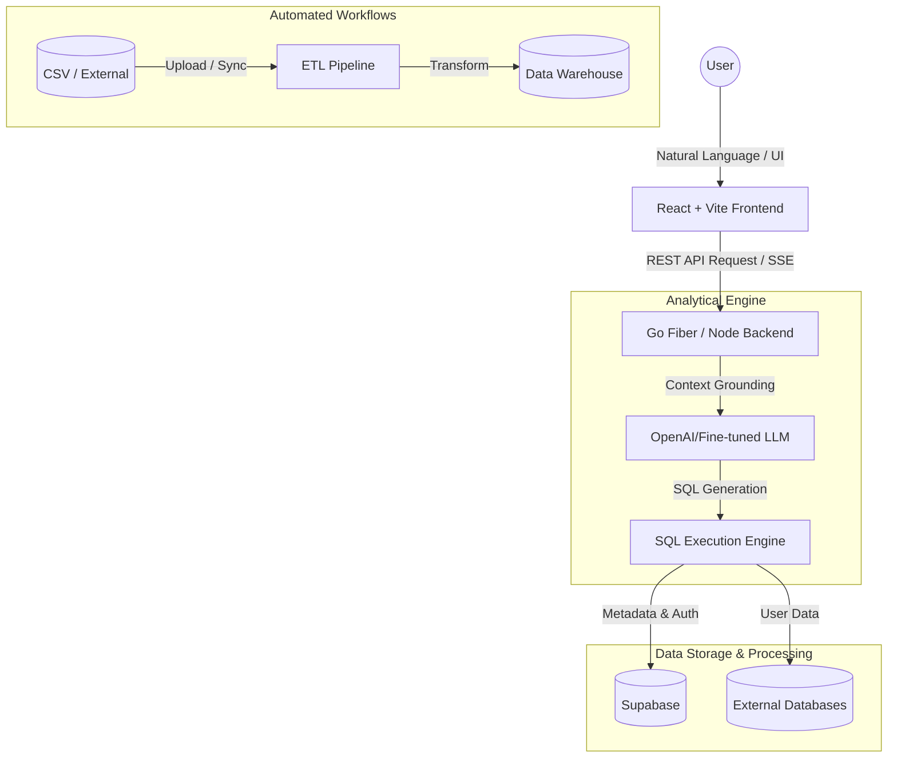

# DataLens - Enterprise AI Analytics & BI Platform

[](https://vitejs.dev/)
[](https://reactjs.org/)
[](https://www.typescriptlang.org/)
[](https://go.dev/)
[](https://supabase.com/)

DataLens is a high-performance, enterprise-grade **Business Intelligence (BI) and Data Engineering platform**. It bridges the gap between raw data silos and strategic decision-making by leveraging a sophisticated **NL2SQL AI Engine** and a **Modern Hybrid Data Architecture**.

---

## 🏛️ System Architecture

DataLens is built on the principles of **Clean Architecture** and **Domain-Driven Design**, ensuring decoupling between data ingestion, analytical processing, and client delivery.



---

## 🚀 Key Features & Capabilities

DataLens has grown into a comprehensive BI and Analytics operating system:

### 🛠️ Data Infrastructure & Engineering
- **External Connections**: Support for PostgreSQL, MySQL, SQL Server, BigQuery, and Snowflake out of the box.
- **Visual ETL Engine & Data Pipeline**: Drag-and-drop pipeline for data ingestion, transformation, and warehouse mapping.
- **Smart Schema & DB Diagram**: Automated database profiling, relationship visualization (ERD Generation), and data modeling tools.
- **Data Profiling**: Deep insights into dataset quality, completeness, and distribution instantly.
- **Data Refresh & Scheduling**: Automated synchronization for keeping datasets in perfect parity with sources.

### 🧠 Advanced AI Capabilities
- **Ask Data (NL2SQL)**: Chat with your data in natural language. The AI converts queries to SQL and runs them securely.
- **AI Reports & Data Stories**: Automated AI-generated insights summarization from raw data to generate executive summaries.
- **Enterprise Data Assistant**: Context-aware AI integrated directly into the Query Editor and ETL builders to aid in complex logic.

### 📊 Visualization & Dashboarding
- **Chart Builder & Dashboard Builder**: Responsive, drag-and-drop canvas with full charting library (ECharts & Recharts).
- **Interactive Dashboards**: Features like Cross-Filtering, Drill-Downs, Parameters, and dynamic filtering.
- **Pivot Tables & KPI Scorecards**: Advanced tabular analysis and executive performance tracking components.
- **Geo-Visualization**: Interactive spatial mapping for regional and geographical data tracking.
- **Conditional Formatting & Calculated Fields**: Excel-like cell formatting and custom business logic editor for derived metrics.

### 🔐 Security & Governance
- **Row-Level Security (RLS)** & Data Privacy: Granular access control for sensitive report sharing and multi-tenant isolation.
- **Embed & Share**: Secure iFrame embedding and public/private sharing mechanisms.
- **Report Automation**: Scheduled reports delivered via email/webhook, plus PDF Export capabilities.

---

## 💻 Technical Stack

### Frontend Architecture
- **Framework**: React 18, TypeScript, Vite
- **Styling**: Tailwind CSS, Shadcn UI (Radix Primitives)
- **State Management**: Zustand, TanStack Query (React Query)
- **Visualization**: Recharts, Apache ECharts, Deck.gl / React Map GL
- **Interactions**: Framer Motion, @hello-pangea/dnd (Drag and Drop), React Grid Layout

### Backend & Infrastructure
- **Core API**: Go (Golang) / Node.js
- **Database**: PostgreSQL / Supabase
- **Realtime**: Server-Sent Events (SSE) / WebSockets
- **Authentication**: JWT, OAuth Integration

---

## 📂 Project Structure

```text
.
├── src/                   # React Frontend Source
│   ├── components/        # Reusable UI components & Layouts (Shadcn + Custom)
│   ├── context/           # React Context for Global Authentication/Theme
│   ├── hooks/             # Custom React Hooks
│   ├── pages/             # 40+ Managed BI Feature Pages (ETL, Dashboard, Schema, Auth, etc.)
│   └── lib/               # Utilities, styling helpers (cn), API clients
├── package.json           # Frontend dependencies and scripts
└── README.md              # You are here!
```

---

## ⚙️ Development Guide

### Prerequisites
- Node.js (v18+)
- npm or pnpm
- A Supabase Project (for DB & metadata Auth)

### Setup Instructions

1. **Clone the repository:**
   ```bash
   git clone https://github.com/yogisyahroni/TOOLS_BI.git
   cd TOOLS_BI
   ```

2. **Install Frontend Dependencies:**
   ```bash
   npm install
   ```

3. **Environment Setup:**
   Create a `.env` file in the root directory.
   ```env
   VITE_SUPABASE_URL=your_supabase_url
   VITE_SUPABASE_ANON_KEY=your_supabase_anon_key
   ```

4. **Run the Development Server:**
   ```bash
   npm run dev
   ```

5. **Build for Production:**
   ```bash
   npm run build
   ```

---

## 📩 Contact & Portfolio

*This project serves as a showcase of capabilities in full-stack architecture, data engineering, and AI integration.*

- **Goal**: Enabling 10x faster speed-to-insight for non-technical stakeholders through beautiful interfaces and powerful query engines.
- **Availability**: Open to Data Engineer, Backend Architect, or Senior Full-stack opportunities.
