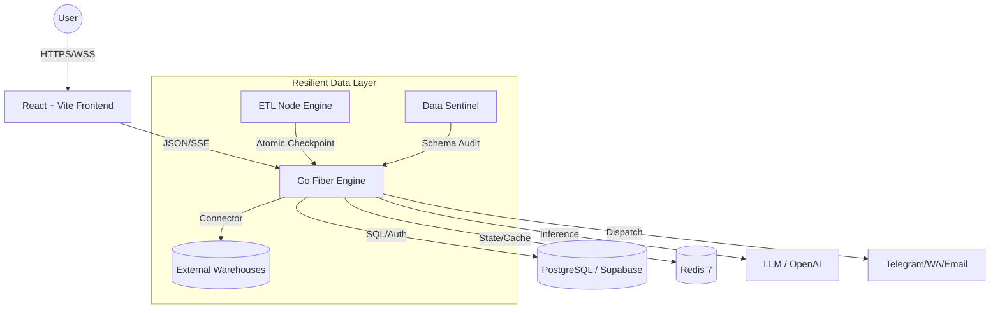

<div align="center">
  
  
  
  
  
  
  
  

  <br />
  <br />

  <h1>Neuradash v2.0</h1>
  <p><b>Enterprise AI Analytics & Autonomous Strategic BI Platform</b></p>
  <p>A high-performance "Data Operating System" designed to bridge the gap between fragmented data silos and actionable strategic intelligence through sentient autonomous agents and resilient engineering.</p>
</div>

---

## 🏛️ Project Vision
**Neuradash** is not just another dashboarding tool; it is an end-to-end analytical ecosystem. In its v2.0 evolution, it transitions from a traditional BI tool to a **Sentient Analytics Layer**. It handles the entire data lifecycle—from visual-node **ETL pipelines** and **automated data profiling** to **Autonomous Causal Investigation** and **Multi-Channel Alert Dispatching**.

Designed for high-reliability environments, Neuradash features unique **resource-aware processing** and **atomic persistence** to ensure zero downtime during massive data migrations.

---

## 🚀 Premium Desktop Experience (Tauri v2)

[](https://github.com/yogisyahroni/TOOLS_BI/releases/latest)
[](https://github.com/yogisyahroni/TOOLS_BI/releases/latest)

Neuradash Sentinel is now available as a high-performance desktop application, providing a more integrated and powerful analytics experience beyond the browser.

### 📥 Download Latest Version
Get the production-ready installer for your system:
- **[Download for Windows (.msi)](https://github.com/yogisyahroni/TOOLS_BI/releases/latest/download/Neuradash_0.1.9_x64_en-US.msi)** — *Recommended*
- **[Download Portable (.exe)](https://github.com/yogisyahroni/TOOLS_BI/releases/latest/download/Neuradash_0.1.9_x64-setup.exe)**
- **[All Releases](https://github.com/yogisyahroni/TOOLS_BI/releases)**

### ✨ Key Desktop Advantages:
- **Native Performance:** Built with Rust for maximum speed and sub-100MB RAM footprint.
- **Auto-Update Engine:** Seamless background updates—always stay on the latest version without manual re-installation.
- **Enterprise Security:** Signed binaries with minisign-based signature verification for update integrity.
- **System Tray & Notifications:** Real-time alert monitoring even when the application is closed.
- **Hardware Acceleration:** Optimal rendering for complex 3D geospatial visualizations.

---

## 🔥 Key Innovations & Features

### 🤖 Next-Gen Autonomous Intelligence
*   **Autonomous Causal Investigation**: Beyond reporting "what" happened, Neuradash triggers deep-dive forensic agents on every KPI breach to identify the "why" through automated cross-dataset reasoning.
*   **Semantic Join Intuition**: Advanced AI logic that autonomously discovers relationships between datasets by prioritizing **Unique Identifiers** (SKU, Resi, Order ID) to ensure 100% data integrity during multi-source synthesis.
*   **Agentic AI Dashboard Builder (✨ Vercel v0 Style)**: Construct entire BI dashboards from raw natural language. The AI autonomously plans the architecture, executes optimized SQL, and generates a responsive **12-column grid layout** live via **SSE Streaming**.
*   **5 Expert AI Personas**: Dynamically switch between specialized agents: *Data Visualization Architect*, *Predictive Analyst*, *Financial Risk Expert*, *Anomaly Detection Specialist*, and *NLP Sentiment Analyst*.
*   **4 Autonomous Strategic Pillars**:
    *   **Forensic Anomaly Investigator**: Automated root cause investigation for KPI breaches.
    *   **Schema Sentinel**: Maintains schema integrity and autonomous semantic join discovery.
    *   **Self-Healing SQL Engine**: Autonomous query correction and multi-layer security hardening.
    *   **Prescriptive Workflow Engine**: Automation of data-driven preventive and corrective actions.

### 📡 Active Alerting & Foresight
*   **Multi-Channel Dispatcher**: Autonomous reports are delivered directly to **Telegram**, **WhatsApp**, and **Enterprise Email** (Rich HTML templates).
*   **Live Forensic Widget**: A real-time dashboard feed displaying active AI investigations, causal findings, and prescriptive recommendations.
*   **Drift Sentinel Banner**: Persistent top-tier UI alert system for mission-critical infrastructure status and schema integrity warnings.

### 🛠️ Robust Data Engineering
*   **Visual ETL & Node-Based Pipelines**: Drag-and-drop interface with **Atomic Checkpoint & Resume** mechanisms for zero-interruption data workflows.
*   **Dynamic Resource-Aware Chunking**: Real-time RAM/CPU monitoring that dynamically adjusts batch sizes to prevent **Out-of-Memory (OOM)** crashes, even on limited infrastructure.
*   **Proactive Data Profiling**: Instantly extract deep insights from raw datasets: null distributions, categorical grouping, and statistical benchmarking.

### 📊 Professional Visualization & Experience
*   **12-Column Responsive Matrix**: High-fidelity dashboard canvas with drag-and-drop, resizing, and intelligent grid snapping.
*   **High-Performance Geospatial Mapping**: Powered by **MapLibre** and **Deck.gl** for rendering millions of spatial data points with interactive regional performance tracking.
*   **Interactive Drill-Downs & Cross-Filtering**: Selecting a segment in one chart automatically filters all related visualizations using state-synchronized context.

### 🔐 Governance & Security (Pillar 5 Hardening)
*   **Action Safeguards**: AI-suggested prescriptive actions are passed through a strict **Validation Layer** to prevent malformed payloads or malicious script injections.
*   **Strict Row-Level Security (RLS)**: Fine-grained access control policies ensuring multi-tenant isolation and PII protection at the database layer.
*   **Adaptive Rate-Limiting**: Sliding-window cooldowns for AI tasks to protect infrastructure from runaway costs.

---

## 💻 Tech Stack

| Layer | Technologies |
| :--- | :--- |
| **Frontend** | React 18, TypeScript, Vite, Tailwind CSS, Shadcn UI, Framer Motion |
| **State** | Zustand (Global), TanStack Query (Server-state), WebSocket WSS (Live Streams) |
| **Visualization** | Apache ECharts, Recharts, Deck.gl, MapLibre |
| **Backend** | **Go 1.22** (Fiber v2), GORM, PostgreSQL 16, Redis 7 |
| **AI/ML** | Multi-agent Orchestration, OpenAI GPT-4o, Proprietary Prompt-Refining Engine |
| **Infrastructure** | Docker, Supabase, Redis Pub/Sub, Cron-based Sentinel Jobs |

---

## 📐 System Architecture



---

## 📂 Project Structure

```text
.
├── src/                    # Frontend: React 18 UI & State
│   ├── components/         # AnomalyForensics, DriftSentinel, Recharts, Geo-viz
│   ├── components/realtime # WebSocket handlers & Toast listeners
│   └── pages/              # 40+ Features (AI Builder, ETL, Data Stories)
├── neuradash-backend/       # Backend: Go 1.22 Autonomous Core
│   ├── internal/services/  # AI Synthesis, Notification, Integration Service
│   ├── internal/handlers/  # Cron (Alert/Sentinel), AI, Dataset Handlers
│   └── cmd/server/         # Entrypoint
```

---

## ⚙️ Quick Start

### Installation
1.  **Clone & Enter**:
    ```bash
    git clone https://github.com/yogisyahroni/TOOLS_BI.git
    cd TOOLS_BI
    ```
2.  **Infrastructure**:
    ```bash
    docker-compose up -d  # Spins up DB, Redis, MinIO
    ```
3.  **Launch**:
    - Backend: `cd neuradash-backend && go run ./cmd/server/`
    - Frontend: `npm install && npm run dev`

---

## 📩 Purpose & Capabilities
Neuradash serves as a showcase of **High-End Full-stack Technical Architecture**, **Autonomous AI Integration**, and **Resilient Data Engineering**. It is built with a focus on:
- **Resilience**: Handling massive data without crashes.
- **Velocity**: Accelerating speed-to-insight by 10x via AI.
- **Aesthetics**: Premium UI/UX that meets 2024 enterprise standards.

**Built for the next generation of data-driven enterprises.**
