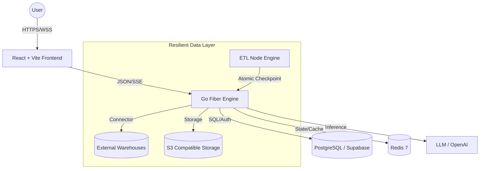

<div align="center">
  
  
  
  
  
  

  <br />
  <br />

  <h1>Neuradash</h1>
  <p><b>Enterprise AI Analytics & Strategic BI Platform</b></p>
  <p>A high-performance "Data Operating System" designed to bridge the gap between fragmented data silos and actionable strategic intelligence through autonomous AI and resilient engineering.</p>
</div>

---

## 🏛️ Project Vision
**Neuradash** is not just another dashboarding tool; it is an end-to-end analytical ecosystem. It handles the entire data lifecycle—from visual-node **ETL pipelines** and **automated data profiling** to **Natural Language to SQL (NL2SQL)** conversion and autonomous **Agentic Dashboard Generation**. 

Designed for high-reliability environments, Neuradash features unique **resource-aware processing** and **atomic persistence** to ensure zero downtime during massive data migrations.

---

## 🔥 Key Innovations & Features

### 🤖 Next-Gen AI Analytics
- **Agentic AI Dashboard Builder (✨ Vercel v0 Style)**: Construct entire BI dashboards from raw natural language instructions. The AI autonomously plans the architecture, executes optimized SQL, and generates a responsive **12-column grid layout** live via **SSE Streaming**.
- **AI SQL Rewriting Engine (S++ Precision)**: A proprietary normalization layer that intercept AI-generated SQL and automatically maps logical dataset names to their underlying physical PostgreSQL tables (`ds_uuid`). This ensures **100% query accuracy** and eliminates "relation does not exist" errors caused by AI hallucination.
- **Ask Data (Advanced NL2SQL)**: Chat with your database. Our optimized inference engine resolves complex queries and recommends the best-fit visualizations (Bar, Line, Pie, Radar, or Tables) instantly.
- **5 Expert AI Personas**: The system intelligently switches between specialized agents: *Data Visualization Architect*, *Predictive Analyst*, *Financial Risk Expert*, *Anomaly Detection Specialist*, and *NLP Sentiment Analyst*.
- **Async BI Migration Engine**: Convert legacy enterprise assets (**Power BI `.pbix`**, **Tableau `.twbx`**, **PowerPoint `.pptx`**) into functional Neuradash templates asynchronously in the background.
- **AI-Powered Resilience (Checkpoint & Resume)**: Atomic persistence mechanism that saves migration progress at every step. If infrastructure failures occur, users can resume complex AI tasks with a single click from the last successful checkpoint.

### 🛠️ Robust Data Engineering
- **Visual ETL & Node-Based Pipelines**: Drag-and-drop interface for building complex Extract, Transform, Load (ETL) workflows without writing code.
- **Dynamic Resource-Aware Chunking**: Real-time RAM and CPU monitoring on the backend. The system dynamically adjusts batch sizes to prevent **Out-of-Memory (OOM)** crashes, ensuring stability even on limited infrastructure (e.g., Render Free Tier).
- **Proactive Data Profiling**: Instantly extract deep insights from raw datasets, including null distributions, categorical grouping, and statistical min/max/average metrics.
- **Enterprise Connectivity**: Native support for **PostgreSQL**, **MySQL**, **SQL Server**, **Snowflake**, and **BigQuery** with secure read-only SQL execution and schema-introspection.

### 📊 Professional Visualization
- **12-Column Responsive Matrix**: A high-fidelity dashboard canvas supporting drag-and-drop interactions, resizing, and intelligent grid snapping.
- **High-Performance Geospatial Mapping**: Powered by **MapLibre** and **Deck.gl** for rendering millions of spatial data points with interactive regional performance tracking.
- **Interactive Drill-Downs & Cross-Filtering**: Slice and dice data with ease. Selecting a segment in one chart automatically filters all related visualizations using state-synchronized context.
- **Executive KPI Scorecards**: Real-time tracking of critical business metrics with benchmarking and comparative period analysis.

### 🔐 Governance & Security
- **Strict Row-Level Security (RLS)**: Fine-grained access control policies ensuring multi-tenant isolation and PII protection at the database layer.
- **Secure Embed & Share**: Generate signed URLs and secure Iframes for internal portals or public presentations with preloaded metadata support.
- **Audit-Ready Logs**: Comprehensive tracking of query execution, data access, and metadata changes.

---

## 💻 Tech Stack (Grade S++)

### **Frontend Architecture**
- **Core**: React 18 + TypeScript + Vite.
- **Styling**: Tailwind CSS + Shadcn UI (Radix Primitives).
- **State Management**: **Zustand** (Global UI) + **TanStack Query** (Server-state caching & deduplication).
- **Graphics Engine**: Apache ECharts, Recharts, Deck.gl, Framer Motion.
- **Canvas**: React Grid Layout + @hello-pangea/dnd.

### **Backend Infrastructure**
- **Language**: **Go 1.22** (Concurrency-optimized).
- **Framework**: Fiber v2 (Enterprise API Engine).
- **Persistence**: GORM + PostgreSQL 16 (Stateless architecture).
- **Real-time**: Redis 7 + WebSocket Hubs for live dashboard synchronization.
- **AI Core**: Native LLM bridging with specialized prompt-refining logic.

---

## 📐 System Architecture



---

## 📂 Project Structure

```text
.
├── src/                   # Frontend: React 18 UI & State
│   ├── components/        # Shadcn UI, Recharts, Geo-viz
│   ├── pages/             # 40+ Features (AI Builder, ETL, Data Stories)
│   └── lib/               # Shared logic & Client initializers
├── neuradash-backend/      # Backend: Go 1.22 Concurrent Core
│   ├── internal/          # Business logic (Planning, Parsing, OOM Guard)
│   ├── cmd/server/        # Entrypoint
│   └── docker-compose.yml # Dev infrastructure (DB, Redis, MinIO)
├── package.json           # Frontend dependencies
└── README.md              # Project documentation
```

---

## ⚙️ Quick Start

### Prerequisites
- Node.js (v18+)
- Go (v1.22+)
- Docker (for local infrastructure)

### Installation
1. **Clone the Repo**:
   ```bash
   git clone https://github.com/yogisyahroni/TOOLS_BI.git
   cd TOOLS_BI
   ```
2. **Setup Infrastructure**:
   ```bash
   docker-compose up -d
   ```
3. **Environment Configuration**:
   - Create `.env` in root for Frontend (VITE_SUPABASE_URL, etc.).
   - Create `.env` in `neuradash-backend/` for Backend.
4. **Launch Application**:
   - Backend: `cd neuradash-backend && go run ./cmd/server/`
   - Frontend: `npm install && npm run dev`

---

## 📩 Purpose & Capabilities
This project serves as a showcase of high-end **Full-stack Technical Architecture**, **Data Engineering at scale**, and **AI Product Integration**. It is built with a focus on:
- **Resilience**: Handling massive data without crashes.
- **Velocity**: Accelerating speed-to-insight by 10x via AI.
- **Aesthetics**: Premium UI/UX that meets 2024 enterprise standards.

**Built for the next generation of data-driven enterprises.**
