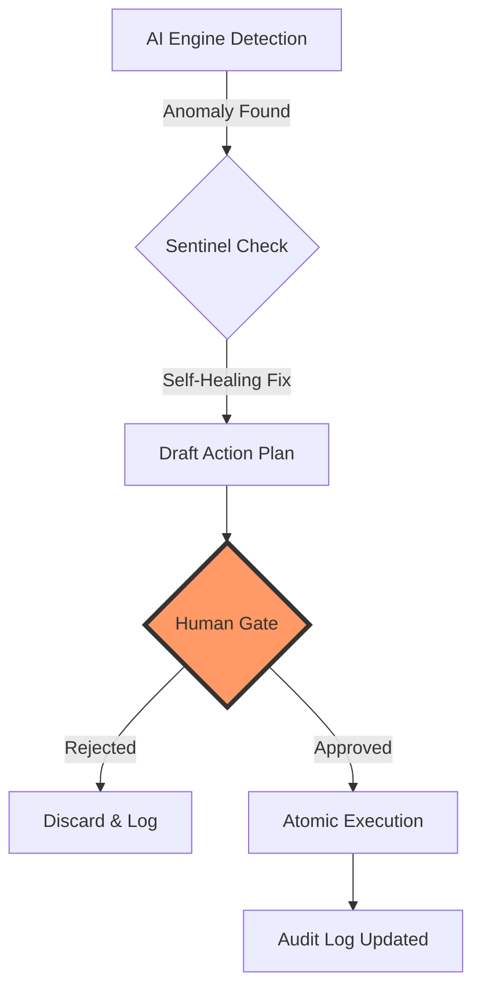

# 🛡️ Security Policy & Architecture

## Responsible Disclosure Policy
If you discover a security vulnerability within Neuradash, please send an email to **security@neuradash.ai** (or open a private security advisory on GitHub). We ask that you do not disclose the issue publicly until we have had a chance to address it.

**We commit to:**
- Acknowledging your report within 24 hours.
- Providing a timeline for the fix.
- Crediting you in our release notes (if desired).

---

## 🏛️ Security Architecture (OWASP ASVS Level 2 Aligned)
Neuradash is engineered with a **Defense-in-Depth** strategy, aligning with industry-standard security requirements:

### V1: Architecture, Design and Deployment
- **Sentinel-Grade Guardrails**: All AI-generated SQL is validated via AST (Abstract Syntax Tree) parsing before execution.
- **Micro-Segmentation**: Database access for AI operations uses a restricted, read-only user.

### V4: Access Control
- **Zero-Trust Token Management**: JWT-based authentication with secure, HTTP-only cookie storage (SameSite=Strict).
- **Human-in-the-Loop (HITL)**: Autonomous actions (dispatching alerts, workflow triggers) require manual cryptographic approval.

### V5: Input Validation & Sanitization
- **AST-Based SQL Protection**: Zero reliance on regex alone; structural analysis prevents complex injection bypasses.
- **Schema Hardening**: Input schemas are strictly validated via Zod (Frontend) and Pydantic-style models (Backend).

---

## 🤖 Human-in-the-Loop (HITL) Workflow
The following diagram illustrates the manual approval gate for autonomous system actions:

---

## 🧪 Security Test Suite Summary
We maintain a **Zero False Negatives** policy on defined attack patterns.

| Test Vector | Status | Methodology |
|-------------|--------|-------------|
| Multi-Statement (Semicolon) | ✅ PASS | AST Detection |
| Comment-Based Bypass | ✅ PASS | Lexical Analysis |
| Mixed-Case Obfuscation | ✅ PASS | Case-Insensitive Tokenization |
| Union-Select Theft | ✅ PASS | Structural Whitelisting |
| CTE/Subquery Injection | ✅ PASS | Depth-Limited Parsing |

**Total Regression Coverage**: 100% pass rate on **documented test vectors**.
